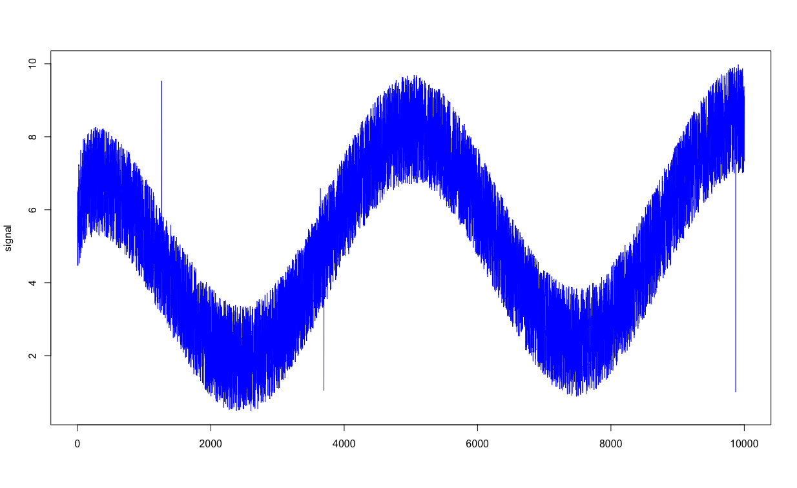
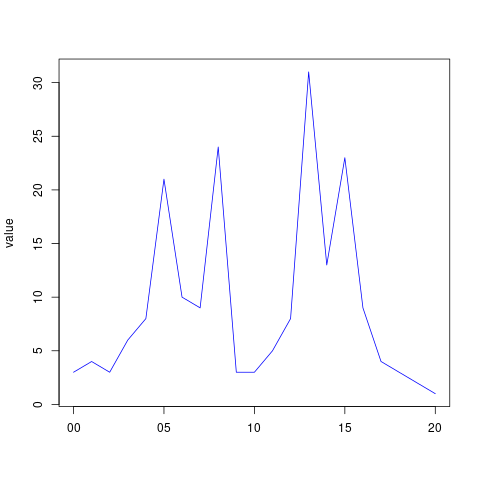
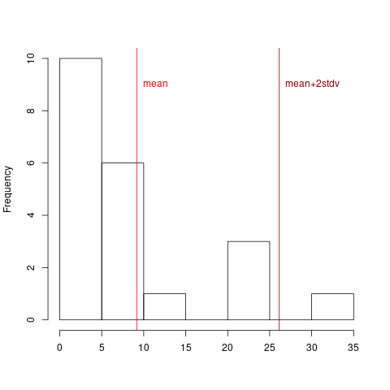
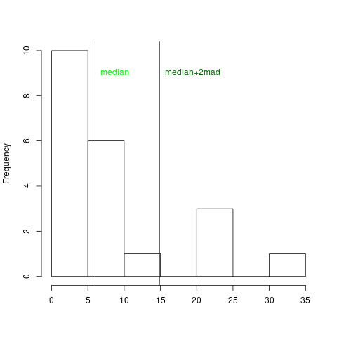

## What is MAD()
MAD() is a Vertica User Defined Transform Function using the [Median Absolute Deviation](https://en.wikipedia.org/wiki/Median_absolute_deviation). to implement a robust anomaly detection system.

We often have to deal with signals changing their statistical properties over time. Think for example to a room exposed to sunlight... we can expect the average temperature to decrease during the nights. To find "anomalies" in these cases we have to "follow" the *natural* drift of the signal.


One possible approach to find the anomalies "following" the signal is to compare its values with the Moving Average of the last N measures. The problem with Moving Averages is that the anomaly we want to identify influences the Average itself.

Suppose you have a signal like this:

As you can see we have a few anomalies (outliers) in this graph. Now if we analyze data distribution with mean and we set a threshold at two standard deviations (2&sigma;) , which should account 95% of the variations in a normal distribution, we get:

as you can see  only one data point exceed our threshold. But if we replace the *mean* with the *median* and the 2&sigma;  threshold with 2mad, we will get them all:


Median Absolute Deviation is defined as:

**MAD= *Const* * *median* ( |X~i~ - X~med~ )**

Where:
- **X~i~** is the i-th value in the data block
- **X~med~** is the median of the data block
- **Const** is a *scale factor* depending on input data distribution (1.4826 for "normal" distribution)

As we want to *follow* the signal to calculate the *moving* Median Absolute Deviation we should also set the **size** of the "rolling  window" we will use calculate our MAD. 

## How MAD() works.
The ```mad()``` function uses the following syntax:
```sql
SELECT mad(<col>)  OVER([PARTITION BY <col1>] 
                         ORDER BY <col2> 
                         [USING PARAMETERS
                             [setsize=N] [, const=M]);                            
```
and returns the following columns:
- ```rownum``` row number starting from 1 (it can be used to join mad() output with the source table (see Makefile)
- ```median```  for the last ```setsize``` rows
- ```mad``` (Median Absolute Deviation)  for the last ```setsize``` rows;
- ```cutoff``` calculated as  ```abs(value-median)/mad``` of the current row with median and mad on the *rolling window* of the last ```setsize``` rows.

The Default Values for the function parameters, if not specified, are:
- ```const``` = 1.4826 (scale factor fr normal distribution)
-  ```setsize``` = 10

## How to install MAD()
Please check (and eventually change) the Makefile before using it. Pay special attention to the C++ compiler executable name. Then:

- First step is to compile the source code: ```make```
- Then - as dbadmin - deploy the code in Vertica: ```make deploy```
- You can run ```make test``` to check everything is ok


Expected compile/deploy/test output:
```bash
$ make
g++-4.8 -O3 -D HAVE_LONG_INT_64 -std=c++11 -Wall -shared -Wno-unused-value -fPIC -I /opt/vertica/sdk/include -o /tmp/lmad.so lmad.cpp /opt/vertica/sdk/include/Vertica.cpp
$ make deploy
CREATE OR REPLACE LIBRARY lmad AS '/tmp/lmad.so' LANGUAGE 'C++';
CREATE LIBRARY
CREATE OR REPLACE ANALYTIC FUNCTION mad AS LANGUAGE 'C++' NAME 'MadFactory' LIBRARY lmad ;
CREATE ANALYTIC FUNCTION
CREATE OR REPLACE ANALYTIC FUNCTION cutoff AS LANGUAGE 'C++' NAME 'CutoffFactory' LIBRARY lmad ;
CREATE ANALYTIC FUNCTION
GRANT EXECUTE ON ANALYTIC FUNCTION mad(x FLOAT) TO PUBLIC ;
GRANT PRIVILEGE
GRANT EXECUTE ON ANALYTIC FUNCTION cutoff(x FLOAT) TO PUBLIC ;
GRANT PRIVILEGE
$ make test
           ts       | val  |   mad   | cutoff  | outlier
--------------------+------+---------+---------+---------
2019-10-11 09:12:00 |  3.0 |         |         |
2019-10-11 09:12:01 |  4.0 |         |         |
2019-10-11 09:12:02 |  5.0 |         |         |
2019-10-11 09:12:03 |  6.0 |         |         |
2019-10-11 09:12:04 |  7.0 |  1.4826 |  1.3490 |  
2019-10-11 09:12:05 | 21.0 |  1.4826 | 10.1174 | *
2019-10-11 09:12:06 | 10.0 |  2.9652 |  1.0117 |  
2019-10-11 09:12:07 |  9.0 |  2.9652 |  0.0000 |  
2019-10-11 09:12:08 | 24.0 |  4.4478 |  3.1476 | *
2019-10-11 09:12:09 |  3.0 | 10.3782 |  0.6745 |  
2019-10-11 09:12:10 |  3.0 |  8.8956 |  0.6745 |  
2019-10-11 09:12:11 |  5.0 |  2.9652 |  0.0000 |  
2019-10-11 09:12:12 |  8.0 |  2.9652 |  1.0117 |  
2019-10-11 09:12:13 | 31.0 |  2.9652 |  8.7684 | *
2019-10-11 09:12:14 |  8.0 |  4.4478 |  0.0000 |  
2019-10-11 09:12:15 | 23.0 |  4.4478 |  3.3725 | *
2019-10-11 09:12:16 |  9.0 |  1.4826 |  0.0000 |  
2019-10-11 09:12:17 |  4.0 |  7.4130 |  0.6745 |  
2019-10-11 09:12:18 |  3.0 |  5.9304 |  0.8431 |  
2019-10-11 09:12:19 |  2.0 |  2.9652 |  0.6745 |  
2019-10-11 09:12:20 |  1.0 |  1.4826 |  1.3490 |  
(21 rows)
```
